# CCS3308 – Virtualization and Containers
## Lab 06: Kubernetes Fundamentals with Minikube

**Name:** G.Darshika Nuwangani  
**Module:** CCS3308 - Virtualization and Containers  
**Week:** Week 7 · Container Orchestration & Kubernetes  

---

## 📌 Overview
This repository contains the setup and deployment scripts for a multi-container application on a single-node Kubernetes cluster using Minikube. It demonstrates core Kubernetes concepts including Pods, Deployments, Services, StatefulSets with Persistent Volumes, Rolling Updates, Self-healing, and Observability.

---

## 🏗️ Application Architecture
The deployed application follows a 4-tier microservices architecture:
- **Frontend Tier:** `nginx:alpine` (Deployment - 3 Replicas, NodePort Service)
- **API Tier:** `kennethreitz/httpbin` (Deployment - 2 Replicas, ClusterIP Service)
- **Cache Tier:** `redis:7-alpine` (Deployment - 1 Replica, ClusterIP Service)
- **Database Tier:** `postgres:16-alpine` (StatefulSet - 1 Replica with 1Gi PVC, Headless Service)

---

## 📁 Repository Structure
```text
lab6/
├── k8s/
│   ├── pod-frontend.yaml
│   ├── deployment-frontend.yaml
│   ├── service-frontend.yaml
│   ├── api-deployment.yaml
│   ├── api-service.yaml
│   ├── cache-deployment.yaml
│   ├── cache-service.yaml
│   ├── postgres-statefulset.yaml
│   └── postgres-service.yaml
├── screenshots/
│   ├── Task 1.1 Screenshot.png
│   ├── task2.1 Screenshot.png
│   ├── Task 3.1 Before screenshot.png
│   ├── Task 3.1 After screenshot.png
│   ├── Task 4.1 Before screenshot.png
│   ├── Task 4.1 After scale up screenshot.png
│   ├── Task 4.1 After scale down screenshot.png
│   ├── Task 5.1 screenshot.png
│   ├── Task 6.1 Rolling update screenshot.png
│   ├── Task 6.1 Rollback screenshot.png
│   ├── Task 7.1 screenshot.png
│   ├── Task 7.2 screenshot.png
│   ├── Task 8.1 screenshot.png
│   ├── Task 9.1 sceernshot.png
│   └── Task 10.1 screenshot.png
├── answers.md
└── README.md
## 🚀 Step-by-Step Implementation & Proofs

### Part 1: Cluster Architecture
- Verified cluster components using `kubectl get pods -n kube-system`.
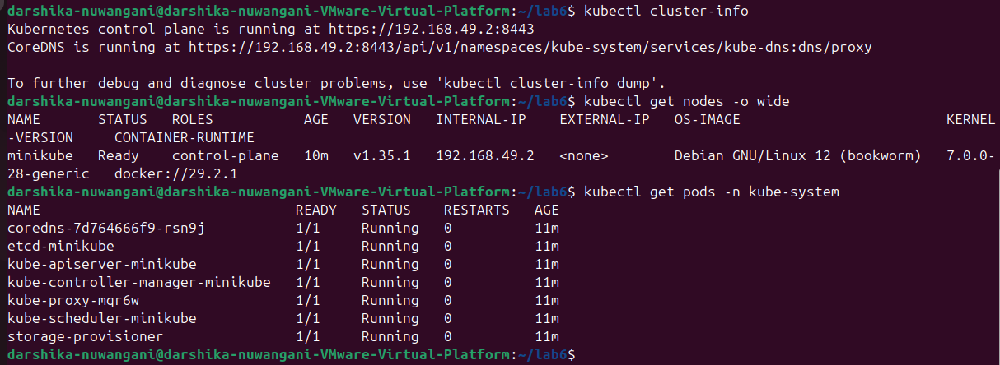

### Part 2: Pod Deployment
- Created and tested the initial frontend pod using `pod-frontend.yaml`.
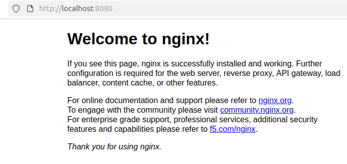

### Part 3: Self-Healing with Deployments
- Observed Kubernetes self-healing behavior before and after deleting a pod.
- **Before Deleting Pod:**
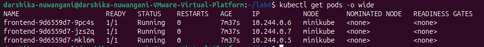
- **After Deleting Pod (Self-Healed):**
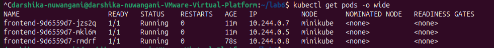

### Part 4: Scaling
- Scaled frontend replicas up to 5 and down to 2 using `kubectl scale`.
- **Before Scale:**
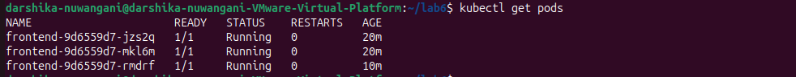
- **Scale Up to 5:**
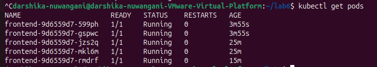
- **Scale Down to 2:**
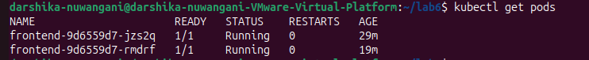

### Part 5: Exposing Services
- Exposed frontend via NodePort service and accessed via browser using `minikube service`.
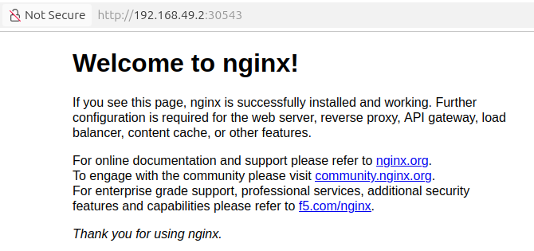

### Part 6: Rolling Updates & Rollbacks
- Performed zero-downtime rolling update and executed a rollback using `kubectl rollout undo`.
- **Rolling Update:**
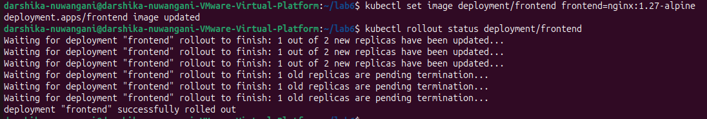
- **Rollback:**
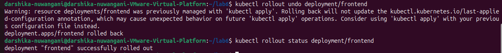

### Part 7: Full Multi-Container App Deployment
- Deployed Frontend, API, Cache, and Database (StatefulSet) tiers.
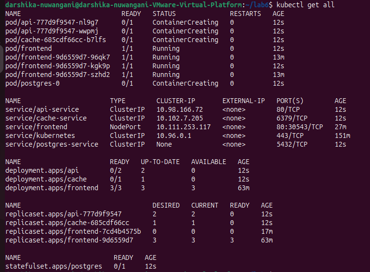
- Verified internal network connectivity using a debug container.
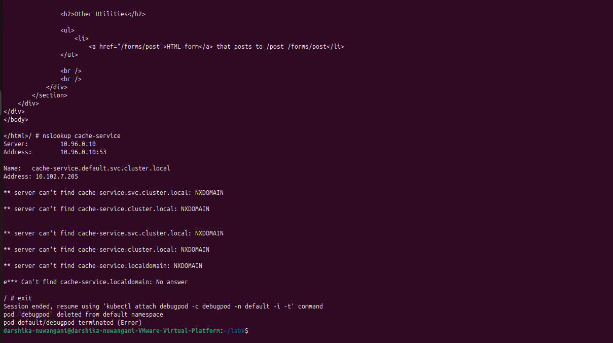

### Part 8: Data Persistence Verification
- Executed SQL query, deleted `postgres-0` pod, and verified data retention after restart.
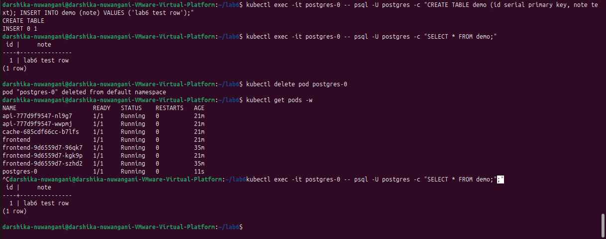

### Part 9: Observability & Troubleshooting
- Investigated pod failures (`ErrImagePull` / `ImagePullBackOff`) using `kubectl describe`.
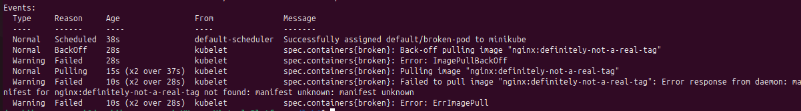

### Part 10: Cleanup
- Removed all created resources and stopped Minikube cluster.
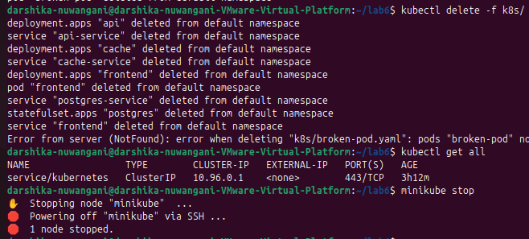
